# 🛒 GreenCart – Full Stack Grocery Delivery Platform

A modern full-stack grocery delivery application built using **Spring Boot**, **React.js**, **MySQL**, and **JWT Authentication**.

GreenCart provides a seamless online grocery shopping experience with secure authentication, product browsing, cart management, online payments, order tracking, product reviews, recipe management, and role-based dashboards.

The platform follows a scalable client-server architecture and integrates modern technologies such as Razorpay payments, email notifications, image uploads, inventory management, and responsive UI design.

---

## 🚀 Tech Stack

| Layer           | Technology                               |
| --------------- | ---------------------------------------- |
| Frontend        | React.js, Vite, Tailwind CSS, JavaScript |
| Backend         | Java 17, Spring Boot, Spring Security    |
| Database        | MySQL                                    |
| ORM             | Hibernate, Spring Data JPA               |
| Authentication  | JWT Authentication                       |
| Payment Gateway | Razorpay                                 |
| Email Service   | Spring Mail (Gmail SMTP)                 |
| File Storage    | Local File Upload System                 |
| Build Tool      | Maven                                    |
| Version Control | Git & GitHub                             |

---

## 📊 Project Statistics

* 20+ REST APIs
* 3 User Roles
* JWT Authentication
* Razorpay Payment Integration
* Email OTP Verification
* Product Review System
* Inventory Management
* Role-Based Access Control
* Responsive UI Design

---

## 🧩 Architecture Highlights

* React + Spring Boot Full Stack Architecture
* RESTful API Communication
* JWT-Based Authentication & Authorization
* Role-Based Access Control (RBAC)
* Dynamic Product & Category Management
* Product Review & Rating System
* Image Upload & Storage System
* Secure Payment Integration
* Responsive Mobile-Friendly Design

---

## ✨ Features

### 👤 User Features

* User Registration & Login
* Email OTP Verification
* JWT Authentication
* Forgot Password Support
* Product Search & Filtering
* Category-Based Browsing
* Shopping Cart Management
* Delivery Address Management
* Order Placement & Tracking
* Product Reviews & Ratings

---

### 🛍 Product Management

* Add Products
* Edit Products
* Delete Products
* Product Categories
* Product Images
* Inventory Management
* Stock Tracking

---

### 📦 Order Management

* Place Orders
* View Order History
* Track Order Status
* Cancel Orders
* Delivery Status Updates

---

### ⭐ Review System

* Product Ratings (1–5 Stars)
* Customer Reviews
* Average Product Rating
* Review Count Tracking
* One Review Per User Per Product

---

### 🍽 Recipe Management

* Create Recipes
* View Recipes
* Recipe Categories
* Recipe Ingredients

---

### 👨‍💼 Seller Dashboard

* Seller Authentication
* Product Catalog Management
* Inventory Monitoring
* Order Management
* Delivery Assignment
* Sales Monitoring

---

### 🚚 Delivery Partner Dashboard

* Assigned Orders
* Delivery OTP Verification
* Upload Delivery Proof
* Order Status Updates

---

### 🛠 Admin Features

* User Management
* Product Monitoring
* Recipe Administration
* Platform Management

---

### 💳 Payment Integration

* Razorpay Payment Gateway
* Secure Online Payments
* Payment Verification
* Cash On Delivery Support

---

### 📧 Email Services

* OTP Verification
* Password Reset Emails
* Account Verification
* Notification Emails

---

## 👥 Role-Based Access

### User

* Browse Products
* Add Products to Cart
* Place Orders
* Track Orders
* Review Products

### Seller

* Manage Products
* Manage Inventory
* View Orders
* Assign Delivery Partners

### Delivery Partner

* View Assigned Orders
* Upload Delivery Proof
* Verify Delivery OTP

### Admin

* Manage Users
* Manage Products
* Manage Recipes
* Monitor Platform Activity

---

## 🔗 API Features

* RESTful APIs
* JWT Protected Routes
* Role-Based Authorization
* Product APIs
* Order APIs
* Review APIs
* Recipe APIs
* Payment APIs
* Authentication APIs

---

## 📂 Project Structure

```bash
GreenCart
│
├── Backend
│   ├── src
│   ├── uploads
│   ├── pom.xml
│   └── application.properties
│
├── Frontend
│   ├── src
│   ├── public
│   ├── package.json
│   └── vite.config.js
│
└── README.md
```

---

## 🛠 Setup Instructions

### Prerequisites

* Java 17+
* MySQL 8+
* Maven
* Node.js
* npm

---

### Clone Repository

```bash
git clone https://github.com/soubhagya-behera/GreenCart.git
cd GreenCart
```

---

### Backend Setup

Create Database:

```sql
CREATE DATABASE greencart;
```

Configure:

```properties
Backend/src/main/resources/application.properties
```

Add your:

* MySQL Credentials
* Gmail SMTP Credentials
* Razorpay API Keys

Run Backend:

```bash
cd Backend
mvn spring-boot:run
```

Backend URL:

```bash
http://localhost:8080
```

---

### Frontend Setup

```bash
cd Frontend
npm install
npm run dev
```

Frontend URL:

```bash
http://localhost:5173
```

---

## 🔐 Security Features

* JWT Authentication
* Password Encryption
* Role-Based Access Control
* Secure API Communication
* Protected Dashboard Access
* Authentication Guards
* OTP Verification

---

## 📸 Screenshots

### Home Page

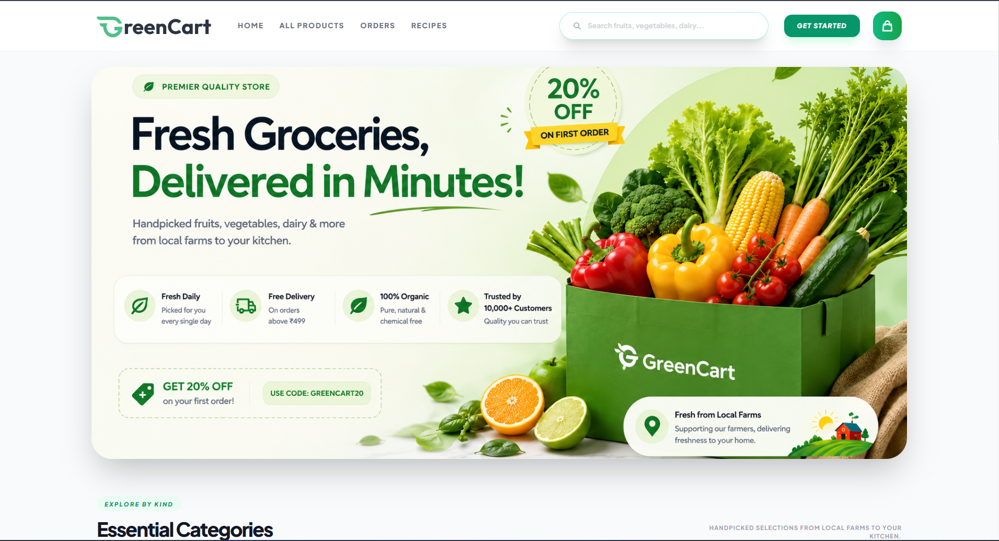

---

### Authentication

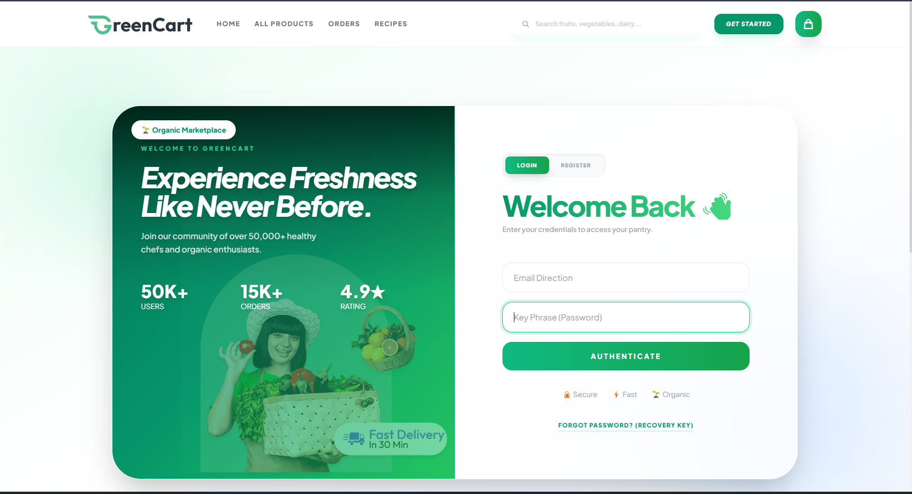

---

### Product Listed

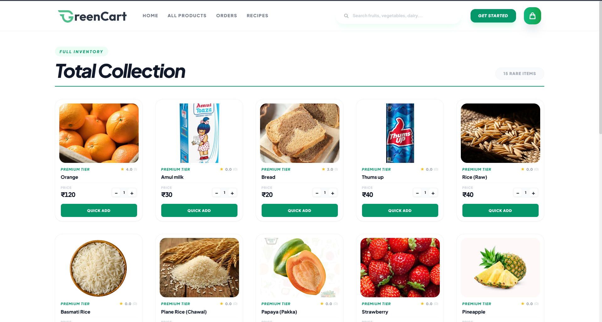

---

### Shopping Cart

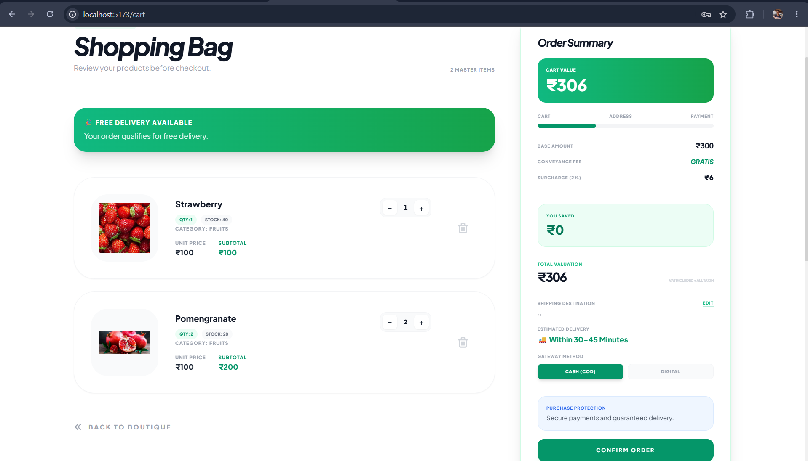

---

### Delivery Address

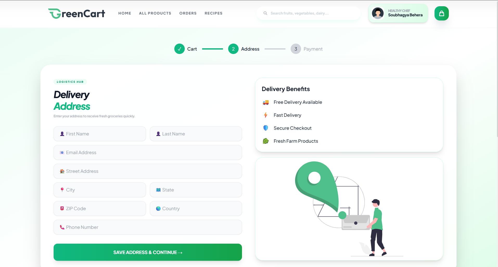

---

### Order Page

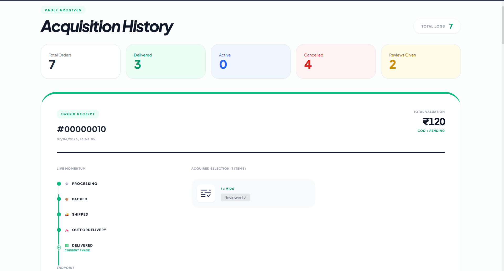

---

### Product Reviews

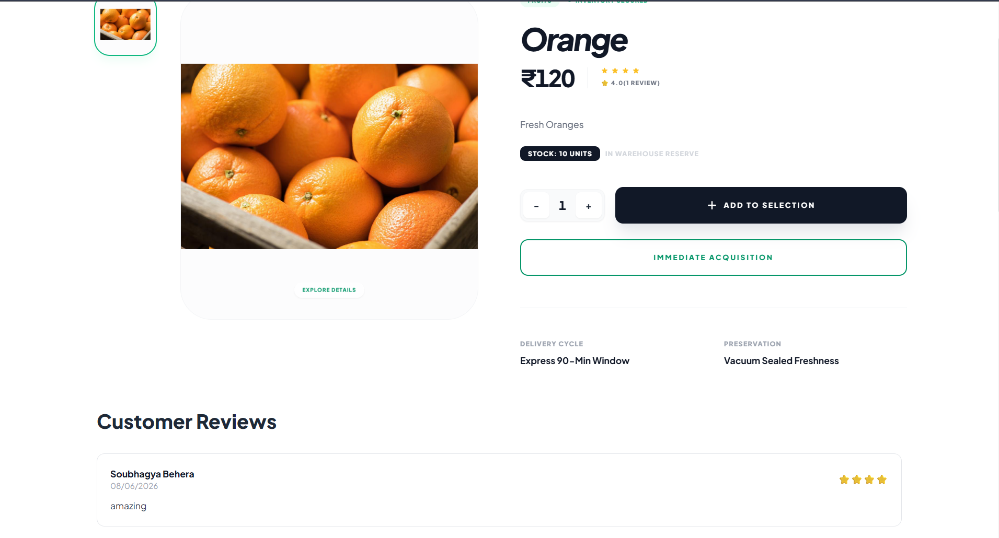

---

### Seller Dashboard

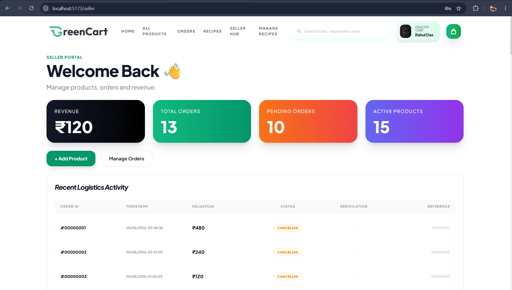

---

### Seller Product Catalog

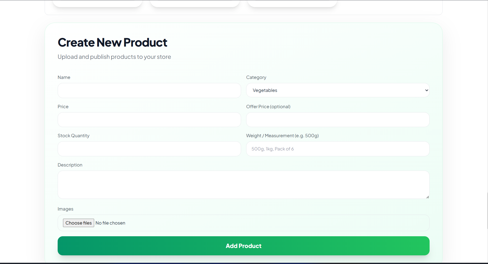

---

### Seller Audit

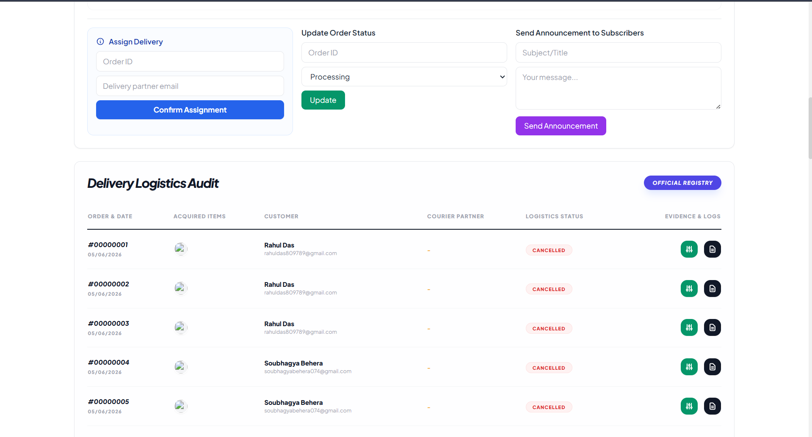

---

### Recipe Studio

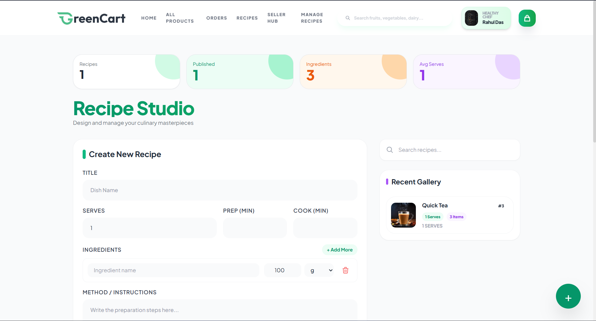

---

### Database Schema

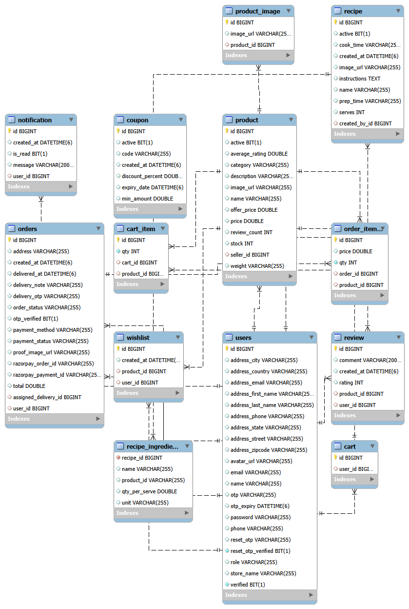

---

## 📈 Future Enhancements

* Wishlist Functionality
* Coupon & Discount System
* Real-Time Order Tracking
* Push Notifications
* Cloud Image Storage (AWS S3 / Cloudinary)
* Docker Deployment
* Kubernetes Deployment
* AWS Cloud Deployment

---

## 💡 What I Learned

* Full Stack Development
* Spring Security & JWT
* REST API Design
* React State Management
* Razorpay Integration
* Email Service Integration
* Database Design
* Role-Based Access Control
* Inventory Management
* Modern UI Development

---

## 👨‍💻 Author

### Soubhagya Kumar Behera

MCA Student | Java Full Stack Developer

* GitHub: https://github.com/soubhagya-behera

* LinkedIn: https://www.linkedin.com/in/soubhagyakumar-java

* Portfolio: https://soubhagya-portfolio-olive.vercel.app

---

## ⭐ Support

If you found this project useful, consider giving it a ⭐ on GitHub.

Your support motivates further development and improvements.
