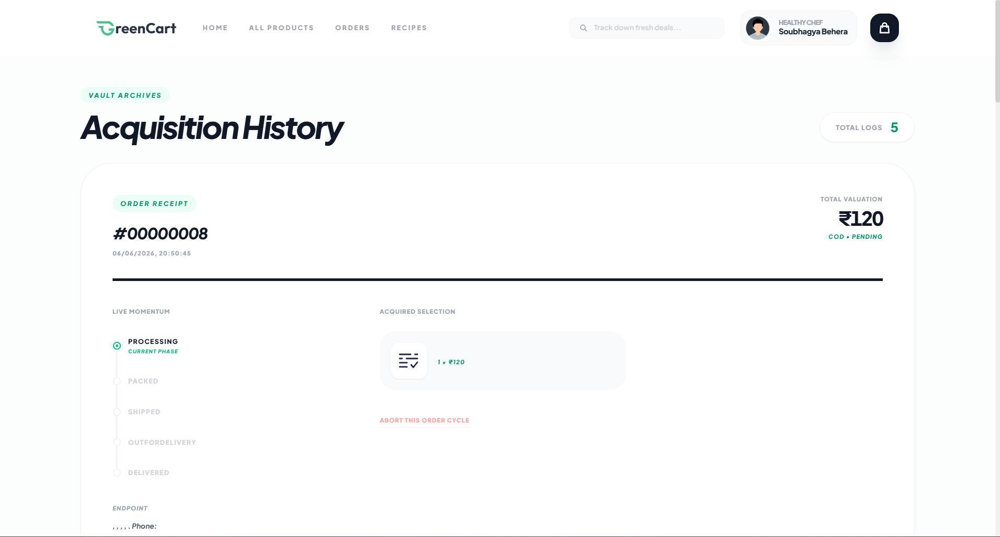
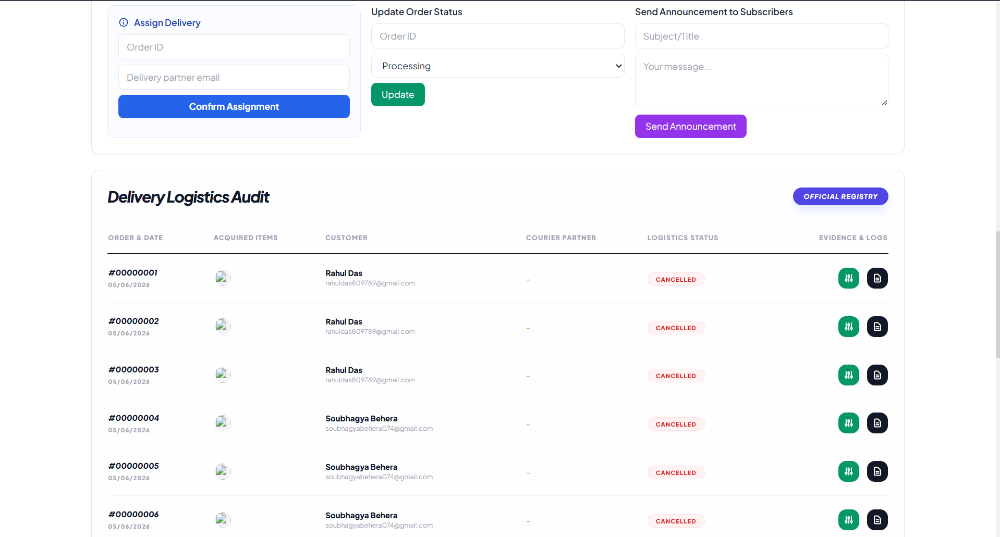
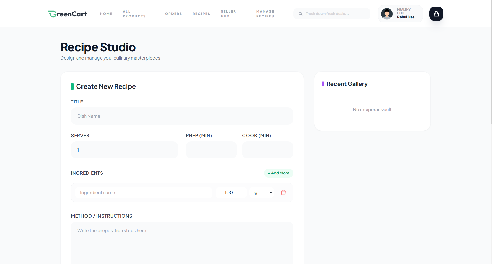

# 🛒 GreenCart – Full Stack Grocery Delivery Platform

A modern full-stack grocery delivery application built using **Spring Boot**, **React.js**, **MySQL**, and **JWT Authentication**. GreenCart provides a seamless online grocery shopping experience with secure authentication, product management, shopping cart functionality, order processing, recipe management, and role-based dashboards.

The platform follows a scalable client-server architecture and integrates modern technologies such as image uploads, email notifications, Razorpay payment processing, and responsive UI design.

---

## 🚀 Tech Stack

| Layer           | Technology                               |
| --------------- | ---------------------------------------- |
| Frontend        | React.js, Vite, Tailwind CSS, JavaScript |
| Backend         | Java 17, Spring Boot, Spring Security    |
| Database        | MySQL                                    |
| Authentication  | JWT Authentication                       |
| ORM             | Spring Data JPA, Hibernate               |
| Payment Gateway | Razorpay                                 |
| Email Service   | Spring Mail (Gmail SMTP)                 |
| File Storage    | Local File Upload System                 |
| Build Tool      | Maven                                    |
| Version Control | Git & GitHub                             |

---

## 🧩 Architecture Highlights

* React + Spring Boot Full Stack Architecture
* RESTful API Communication
* JWT-Based Authentication & Authorization
* Role-Based Access Control
* Dynamic Product & Category Management
* Image Upload & Storage System
* Secure Payment Integration
* Responsive Mobile-Friendly UI

---

## ✨ Key Features

### 👤 User Features

* User Registration & Login
* JWT Authentication
* Profile Management
* Secure Password Handling
* Product Search & Filtering
* Category-Based Product Browsing
* Shopping Cart Management
* Order Placement & Tracking

### 🛍 Product Management

* Add Products
* Edit Products
* Delete Products
* Dynamic Category Management
* Product Image Upload
* Inventory Management

### 📦 Order Management

* Place Orders
* View Order History
* Track Order Status
* Manage Customer Purchases

### 🍽 Recipe Management

* Create Recipes
* View Recipes
* Recipe Categories

### 👨‍💼 Seller Dashboard

* Seller Authentication
* Product Management
* Order Monitoring
* Inventory Tracking

### 🛠 Admin Features

* User Management
* Product Monitoring
* Recipe Administration
* System Management Dashboard

### 💳 Payment Integration

* Razorpay Payment Gateway
* Secure Online Payments
* Payment Verification

### 📧 Email Services

* OTP Verification
* Password Reset Support
* Email Notifications

---

## 📂 Project Structure

```bash
GreenCart Project
│
├── Backend
│   ├── src
│   ├── uploads
│   ├── pom.xml
│   └── application.properties
│
├── Frontend
│   ├── src
│   ├── public
│   ├── package.json
│   └── vite.config.js
│
└── README.md
```

---

## 🛠 Setup Instructions

### Prerequisites

* Java 17+
* MySQL 8+
* Maven
* Node.js
* npm

---

### Installation

#### Clone Repository

```bash
git clone https://github.com/soubhagya-behera/GreenCart.git
cd GreenCart
```

---

### Backend Setup

Create Database:

```sql
CREATE DATABASE greencart;
```

Configure:

```properties
Backend/src/main/resources/application.properties
```

Add your:

* MySQL Credentials
* Gmail SMTP Credentials
* Razorpay API Keys

Run Backend:

```bash
cd Backend
mvn spring-boot:run
```

Backend URL:

```bash
http://localhost:8080
```

---

### Frontend Setup

```bash
cd Frontend
npm install
npm run dev
```

Frontend URL:

```bash
http://localhost:5173
```

---

## 🔐 Security Features

* JWT Authentication
* Role-Based Access Control
* Password Encryption
* Secure API Communication
* Protected Dashboard Access
* Authentication Guards

---

## 📸 Screenshots

### Home Page


---

### Order History



---

### Product Details

(Add Screenshot Here)

---

### Shopping Cart


---

### Seller Dashboard


---

### Seller Audit



---

### Recipe Management



---

## 📈 Future Enhancements

* Wishlist Functionality
* Product Reviews & Ratings
* Coupon & Discount System
* Delivery Partner Dashboard
* Real-Time Order Tracking
* Push Notifications
* Docker Deployment
* Cloud Deployment (AWS)

---

## 👨‍💻 Author

### Soubhagya Kumar Behera

MCA Student | Java Full Stack Developer

* GitHub: https://github.com/soubhagya-behera
* LinkedIn: https://www.linkedin.com/in/soubhagyakumar-java

---

## ⭐ Support

If you found this project useful, consider giving it a ⭐ on GitHub.
