<div align="center">

# 🛒 GreenCart

### Full-Stack Grocery Commerce Platform

<p>
A role-aware grocery marketplace combining secure JWT authentication,
transactional checkout, Razorpay payments with server-side verification,
real-time inventory and delivery events, seller operations,
and delivery lifecycle management in one Spring Boot + React platform.
</p>

<p>
<a href="https://github.com/soubhagya-behera/GreenCart"></a>
<a href="https://grocery-delivery-backend-dvr3.onrender.com"></a>
</p>

<p>


</p>

<p>


</p>

<p>


</p>

<p>
<a href="#features">Features</a> •
<a href="#architecture">Architecture</a> •
<a href="#security">Security</a> •
<a href="#api-reference">API</a> •
<a href="#getting-started">Getting Started</a> •
<a href="#screenshots">Screenshots</a>
</p>

</div>

---

## 🌱 What is GreenCart?

GreenCart is a multi-role grocery commerce platform: customers shop and check out, sellers manage catalogs and inventory, delivery partners claim and fulfil orders, and admins operate the whole marketplace — all coordinated through transactional order workflows and real-time WebSocket events.

| Challenge | GreenCart Approach |
| --- | --- |
| Fragmented shopping flow | Product → cart → checkout → order lifecycle in one platform |
| Multi-role operations | Customer / Seller / Delivery / Admin portals with guarded routes and APIs |
| Stale inventory | Real-time inventory events over `/topic/inventory` |
| Payment trust | Chargeable amount derived server-side; Razorpay signature verified by the backend |
| Delivery coordination | STOMP lifecycle events plus atomic partner assignment |
| Account security | JWT + BCrypt + role/ownership guards, OTP verification and password reset |

---

## ✨ Features

<table>
<tr>
<td width="50%" valign="top">

### 🛍️ Customer Commerce

Browse products, filter by category, manage cart and delivery addresses, check out with COD or Razorpay, track order state, and review purchased products.

</td>
<td width="50%" valign="top">

### 🧑‍💼 Seller Operations

Manage owned product listings, images and stock, handle seller-scoped orders, assign delivery, and view seller analytics with ownership enforcement.

</td>
</tr>
<tr>
<td width="50%" valign="top">

### 🚚 Delivery Lifecycle

Go online, see unassigned requests, accept atomically, pick up, deliver with OTP and proof uploads, and receive live status events.

</td>
<td width="50%" valign="top">

### 👨‍💼 Admin Console

Manage users and roles, oversee products and orders, coordinate delivery partners, publish coupons, and view platform analytics.

</td>
</tr>
<tr>
<td width="50%" valign="top">

### 🔐 JWT Authentication

Stateless JWT authentication with BCrypt password hashing, email OTP verification, and password reset via SMTP.

</td>
<td width="50%" valign="top">

### ⚡ Real-Time Events

STOMP over WebSocket: inventory broadcasts, delivery lifecycle broadcasts, and per-customer order queues, with JWT-checked subscriptions.

</td>
</tr>
<tr>
<td width="50%" valign="top">

### 💳 Razorpay Payments

Server creates the Razorpay order from stored order totals, then verifies the payment signature before marking the order paid and confirmed.

</td>
<td width="50%" valign="top">

### 📦 Transactional Checkout

Checkout runs in one transaction: cart → order items, stock decrement, cart clear, and post-commit event publication. COD proceeds directly; online payment waits for verification.

</td>
</tr>
<tr>
<td width="50%" valign="top">

### 🎟️ Coupons & Wishlist

Admin-managed coupons with minimum amounts and expiry, customer coupon application, plus a personal wishlist.

</td>
<td width="50%" valign="top">

### 🍽️ Recipes, Reviews & Notifications

Recipe studio with product-linked ingredients, one-review-per-user ratings, in-app notifications, and newsletter subscribe/announce flows.

</td>
</tr>
</table>

---

## 👥 Role-Based Platform

Roles are stored as plain strings on `User` (`user`, `seller`, `admin`, `delivery`; default `user`) and enforced case-insensitively by `AccessGuard` / `RoleChecker` on the backend and by route guards on the frontend.

| Role | Responsibilities |
| --- | --- |
| Customer (`user`) | Browse, cart, checkout, payment, orders, reviews, wishlist, coupons, profile |
| Seller (`seller`) | Owned product catalog, stock, images, seller orders, delivery assignment, seller analytics |
| Delivery (`delivery`) | Availability, order requests, atomic accept/reject, pickup, delivery with OTP/proof |
| Admin (`admin`) | Users and roles, platform products and orders, delivery partners, coupons, analytics |

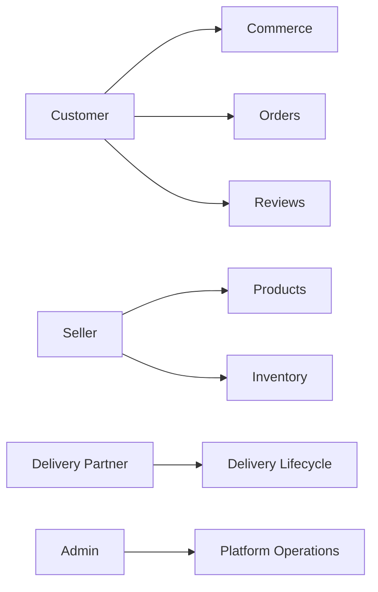
```mermaid
flowchart LR
    CUSTOMER[Customer]
    SELLER[Seller]
    DELIVERY[Delivery Partner]
    ADMIN[Admin]

    CUSTOMER --> SHOP[Commerce]
    CUSTOMER --> ORDER[Orders]
    CUSTOMER --> REVIEW[Reviews]

    SELLER --> PRODUCT[Products]
    SELLER --> INVENTORY[Inventory]

    DELIVERY --> LOGISTICS[Delivery Lifecycle]

    ADMIN --> PLATFORM[Platform Operations]
```

---

## 🔄 How GreenCart Works

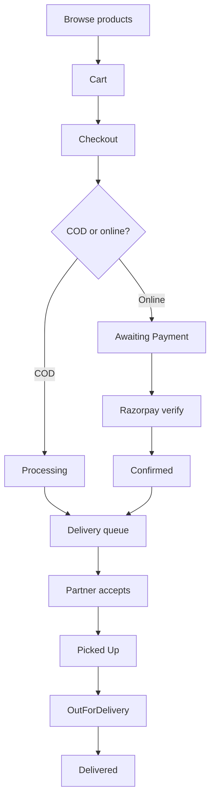
```mermaid
flowchart TD
    BROWSE[Browse products] --> CART[Cart]
    CART --> CHECKOUT[Checkout]
    CHECKOUT --> COD{COD or online?}
    COD -->|COD| PROCESSING[Processing]
    COD -->|Online| AWAIT[Awaiting Payment]
    AWAIT --> VERIFY[Razorpay verify]
    VERIFY --> CONFIRMED[Confirmed]
    PROCESSING --> QUEUE[Delivery queue]
    CONFIRMED --> QUEUE
    QUEUE --> ACCEPT[Partner accepts]
    ACCEPT --> PICKUP[Picked Up]
    PICKUP --> OUTFOR[OutForDelivery]
    OUTFOR --> DELIVERED[Delivered]
```

Seller inventory changes broadcast on `/topic/inventory` while every order transition broadcasts on `/topic/delivery` plus the customer's `/user/queue/orders`.

---

## 🏗️ Architecture

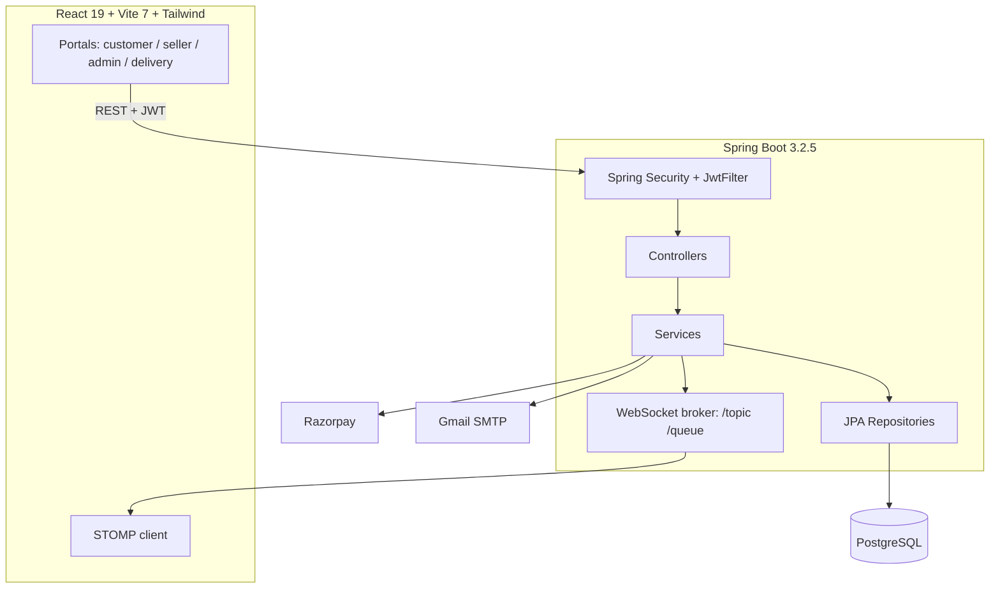
```mermaid
flowchart TD
    subgraph FRONT[React 19 + Vite 7 + Tailwind]
        UI[Portals: customer / seller / admin / delivery]
        SOCK[STOMP client]
    end
    subgraph BACK[Spring Boot 3.2.5]
        SEC[Spring Security + JwtFilter]
        CTRL[Controllers]
        SRV[Services]
        REPO[JPA Repositories]
        WS[WebSocket broker: /topic /queue]
    end
    DB[(PostgreSQL)]
    RZ[Razorpay]
    SMTP[Gmail SMTP]

    UI -->|REST + JWT| SEC
    SEC --> CTRL
    CTRL --> SRV
    SRV --> REPO
    REPO --> DB
    SRV --> RZ
    SRV --> SMTP
    SRV --> WS
    WS --> SOCK
```

Order and delivery state changes are published after successful persistence (after-commit), so subscribers never see events for rolled-back work.

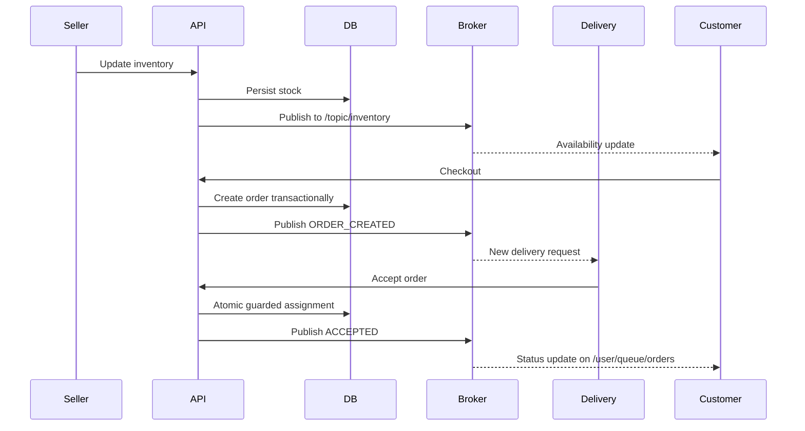
```mermaid
sequenceDiagram
    participant Seller
    participant API
    participant DB
    participant Broker
    participant Delivery
    participant Customer

    Seller->>API: Update inventory
    API->>DB: Persist stock
    API->>Broker: Publish to /topic/inventory
    Broker-->>Customer: Availability update

    Customer->>API: Checkout
    API->>DB: Create order transactionally
    API->>Broker: Publish ORDER_CREATED
    Broker-->>Delivery: New delivery request

    Delivery->>API: Accept order
    API->>DB: Atomic guarded assignment
    API->>Broker: Publish ACCEPTED
    Broker-->>Customer: Status update on /user/queue/orders
```

---

## ⚡ Real-Time Event Architecture

WebSocket endpoint: `/ws` (`WebSocketConfig`). Simple broker on `/topic` and `/queue`, application prefix `/app` (no `/app` handlers defined). The frontend derives the WS URL from the same `VITE_API_URL` host (`http→ws`, `https→wss`), reconnects after 5s, and re-authenticates with the stored JWT on every reconnect.

| Destination | Audience | Purpose |
| --- | --- | --- |
| `/topic/inventory` | Public | `INVENTORY_UPDATED` events (`productId`, `stock`) published directly by `ProductController` |
| `/topic/delivery` | Delivery + admin enforced on SUBSCRIBE; customers receive order flow here too | `NEW_REQUEST`, `ACCEPTED`, `ORDER_STATUS_CHANGED`, `PAYMENT_STATUS_CHANGED`, `ORDER_COMPLETED`, `CANCELLED`, `PARTNER_STATUS`, `DELIVERY_REJECTED` |
| `/user/queue/orders` | Authenticated principal (routed per account email via `convertAndSendToUser`) | Per-customer order updates |

Authentication on CONNECT is optional (public topics keep working), while SUBSCRIBE is guarded by `WebSocketAuthChannelInterceptor`: `/topic/delivery*` requires the `delivery` or `admin` role, `/user/queue/orders` and `/user/topic/delivery` require an authenticated principal, and everything else (for example `/topic/inventory`) stays public.

> [!NOTE]
> `OrderEventPublisher` publishes with after-commit semantics, so a broadcast is only sent when the surrounding transaction actually commits.

---

## 🔐 Security

### Authentication

- Stateless sessions (`SessionCreationPolicy.STATELESS`) with a custom `JwtFilter` that resolves the user id from the `Authorization: Bearer` token and attaches the `User` to the request.
- JJWT 0.11.5 tokens, 7-day expiry, BCrypt-hashed passwords (`BCryptPasswordEncoder` bean in `AppConfig`).
- Email OTP verification on registration plus OTP-based password reset, sent through `EmailService` over Gmail SMTP.
- Public routes are explicit: `/auth/**`, `/ws/**`, `/uploads/**`, `/reviews/**`, plus `GET` product/recipe reads. Everything else requires authentication; role checks live in `AccessGuard` / `RoleChecker` and controller logic rather than URL rules.

### Authorization

- Product mutations require seller/admin ownership (`canManageProduct`; admins bypass ownership).
- Order reads and payment operations require order ownership or admin (`isOrderCustomer`).
- Logistics actions require admin or the assigned delivery partner (`canManageLogistics`).
- Delivery accept/reject strictly require the `delivery` role; rejections are stored per partner (`OrderRejection` with a unique `order_id + partner_id` constraint), so rejecting hides a request only from that partner.

### Payment integrity

`PaymentController` never trusts a client-supplied amount: `POST /payment/create-order` derives the chargeable total from stored order state, and `POST /payment/verify` checks order ownership, verifies the Razorpay HMAC-SHA256 signature (`razorpayOrderId|razorpayPaymentId` against the secret), and only then flips `paymentStatus` to `Paid` and `orderStatus` to `Confirmed`.

> [!IMPORTANT]
> Payment amounts are resolved from server-side order state, and payment signatures are verified by the backend before any order state changes.

### Uploads and secrets

- Uploads use UUID-prefixed filenames under `uploads/` and are served via the `/uploads/**` resource handler (10 MB multipart limit). There is no extension allow-list or traversal sanitisation in `FileUploadService`, so treat uploads as untrusted user content.
- Secrets (DB password, Gmail app password, Razorpay key/secret, JWT secret) come from configuration and environment — `Backend/src/main/resources/application.properties` is gitignored.

> [!WARNING]
> Never commit database passwords, Gmail app passwords, JWT secrets, or Razorpay credentials. The local `application.properties` stays untracked for exactly this reason.

---

## 📦 Order Lifecycle

Order statuses (`OrderStatuses`): `Awaiting Payment`, `Confirmed`, `Processing`, `Packed`, `Shipped`, `Picked Up`, `OutForDelivery`, `Delivered`, `Cancelled`.

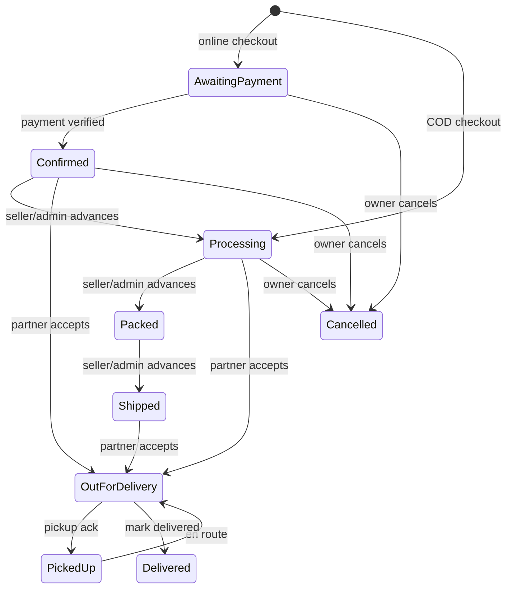
```mermaid
stateDiagram-v2
    [*] --> AwaitingPayment: online checkout
    [*] --> Processing: COD checkout
    AwaitingPayment --> Confirmed: payment verified
    Confirmed --> Processing: seller/admin advances
    Processing --> Packed: seller/admin advances
    Packed --> Shipped: seller/admin advances
    Shipped --> OutForDelivery: partner accepts
    Confirmed --> OutForDelivery: partner accepts
    Processing --> OutForDelivery: partner accepts
    OutForDelivery --> PickedUp: pickup ack
    PickedUp --> OutForDelivery: en route
    OutForDelivery --> Delivered: mark delivered
    AwaitingPayment --> Cancelled: owner cancels
    Confirmed --> Cancelled: owner cancels
    Processing --> Cancelled: owner cancels
```

Checkout is `@Transactional`: it validates the address and cart, rejects inactive products and self-purchase, prices from `offerPrice ?? price`, decrements stock (failing on insufficient stock), clears the cart, and publishes `ORDER_CREATED` plus a delivery request only after commit. COD orders enter `Processing` immediately; online orders wait in `Awaiting Payment` until signature verification. Cancellation is owner-only, blocked once picked up or delivered, restores stock, and publishes `CANCELLED`.

<details>
<summary>🚚 How delivery assignment avoids race conditions</summary>

<br />

Delivery partners list unassigned orders in claimable statuses (`Confirmed`, `Processing`, `Packed`, `Shipped`). Acceptance runs in a transaction and claims the order with a single guarded bulk update (`OrderRepository.claimOrder`): it sets the partner only when `assignedDelivery IS NULL`, the order is undelivered, and the status is still claimable. If two partners accept concurrently, exactly one `UPDATE` affects a row; the loser gets zero rows and a `409 Conflict` ("Order already assigned to another delivery partner"). Only the winner's assignment is persisted, prior per-partner rejections are cleaned up, and the `ACCEPTED` event is published afterwards. This is an atomic conditional update, not distributed locking — it is correct for a single database.

</details>

---

## 🧩 Engineering Highlights

| Area | Implementation |
| --- | --- |
| 🔐 Authentication | JWT (JJWT 0.11.5, 7-day) + BCrypt + stateless `JwtFilter` |
| 🛡️ Authorization | Role + product ownership + order ownership + assigned-logistics guards |
| 💳 Payment integrity | Server-side order amount + Razorpay HMAC signature verification |
| ⚡ Real-time | STOMP topics (`/topic/delivery`, `/topic/inventory`) and user queues (`/user/queue/orders`) |
| 📦 Checkout | Transactional order + stock + cart updates, after-commit events |
| 🚚 Delivery claims | Atomic guarded `UPDATE ... WHERE assignedDelivery IS NULL` |
| 🖼️ Uploads | UUID filenames served under `/uploads/**`, 10 MB limit |
| 📧 Email | OTP verification and password reset via Gmail SMTP |
| 🎟️ Commerce extras | Coupons, wishlist, recipes, reviews, notifications, newsletter |
| 🗄️ Persistence | Spring Data JPA on PostgreSQL |
| 🧩 Frontend | React 19 + Vite 7 + Tailwind + custom router + STOMP.js |

---

## 📸 Screenshots

### Customer Experience

<table>
<tr>
<td width="50%" valign="top">
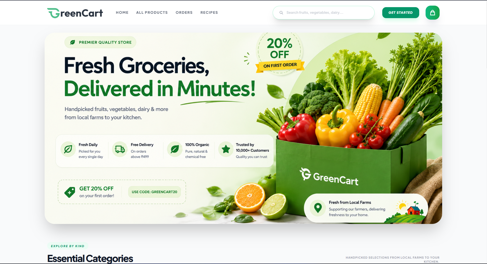
<p align="center"><b>Storefront</b></p>
</td>
<td width="50%" valign="top">
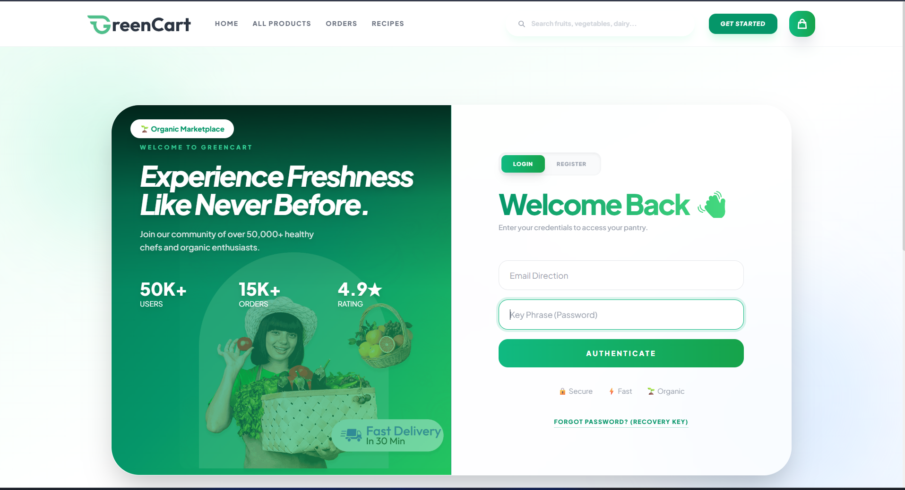
<p align="center"><b>Authentication</b></p>
</td>
</tr>
<tr>
<td width="50%" valign="top">
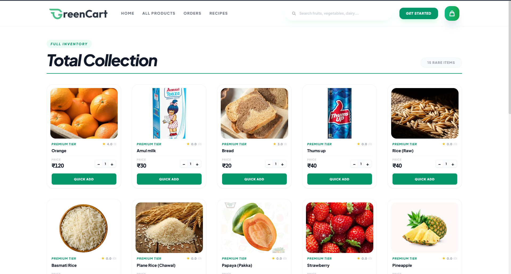
<p align="center"><b>Product Listing</b></p>
</td>
<td width="50%" valign="top">
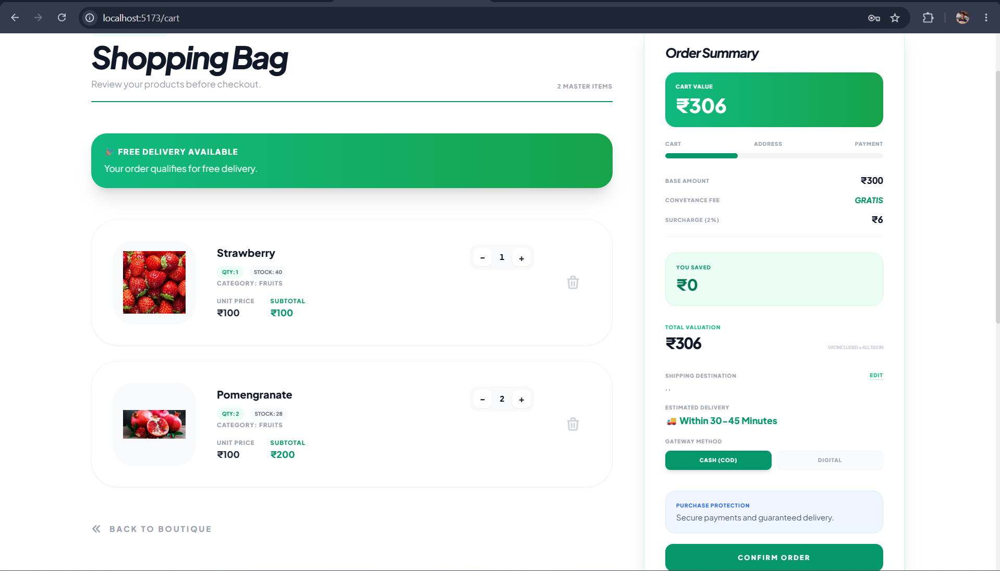
<p align="center"><b>Shopping Cart</b></p>
</td>
</tr>
<tr>
<td width="50%" valign="top">
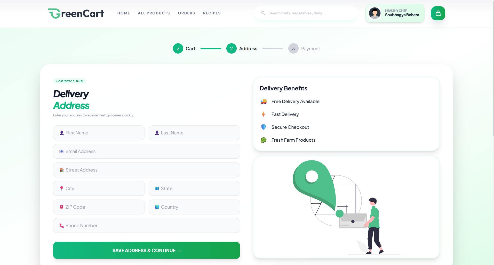
<p align="center"><b>Delivery Address</b></p>
</td>
<td width="50%" valign="top">
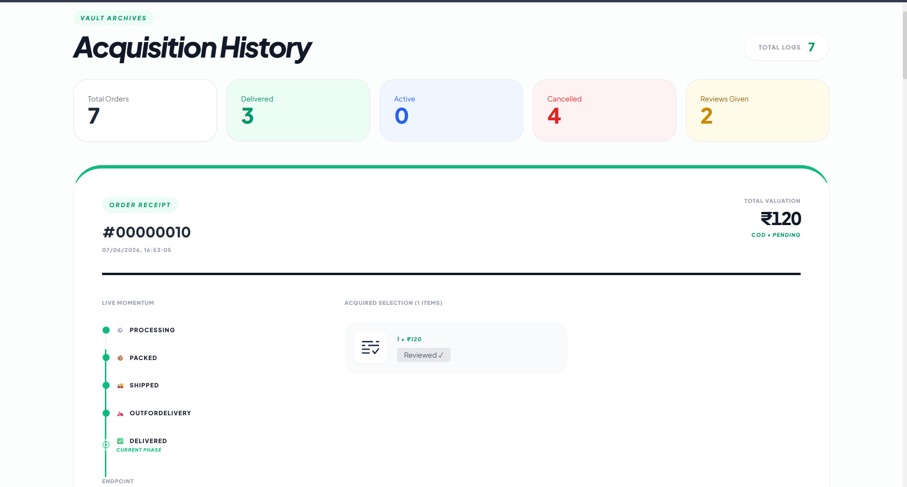
<p align="center"><b>Orders</b></p>
</td>
</tr>
<tr>
<td width="50%" valign="top">
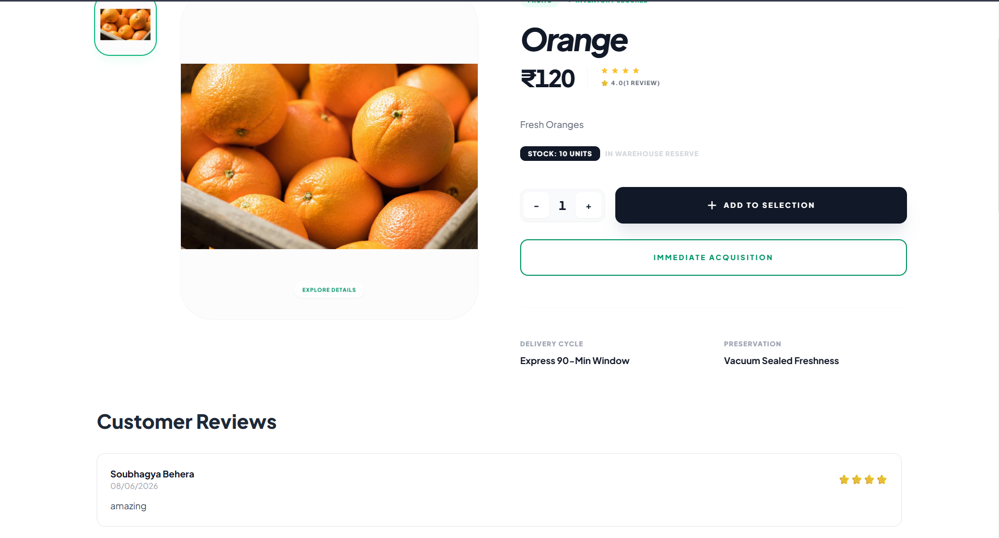
<p align="center"><b>Product Reviews</b></p>
</td>
<td width="50%" valign="top">
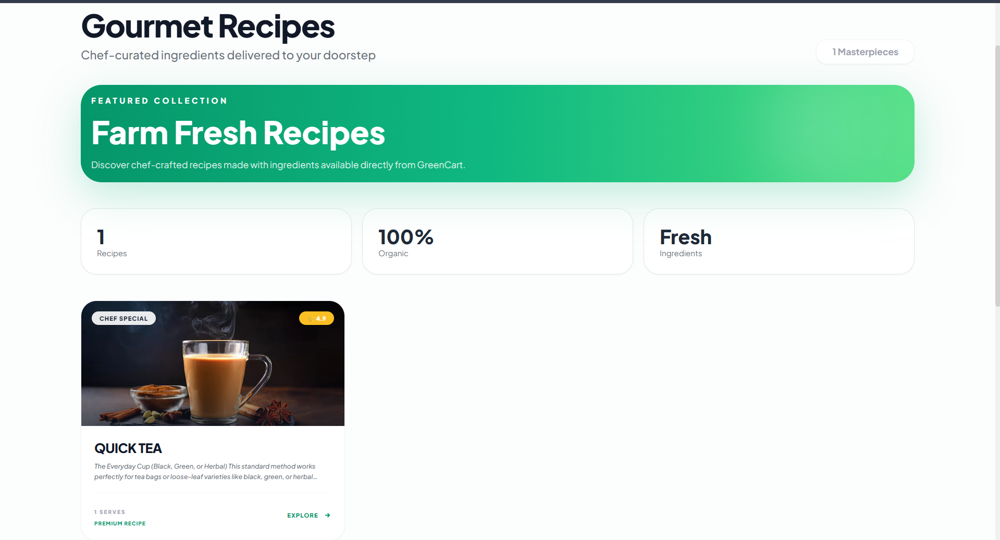
<p align="center"><b>Recipes</b></p>
</td>
</tr>
</table>

### Operations

<table>
<tr>
<td width="50%" valign="top">
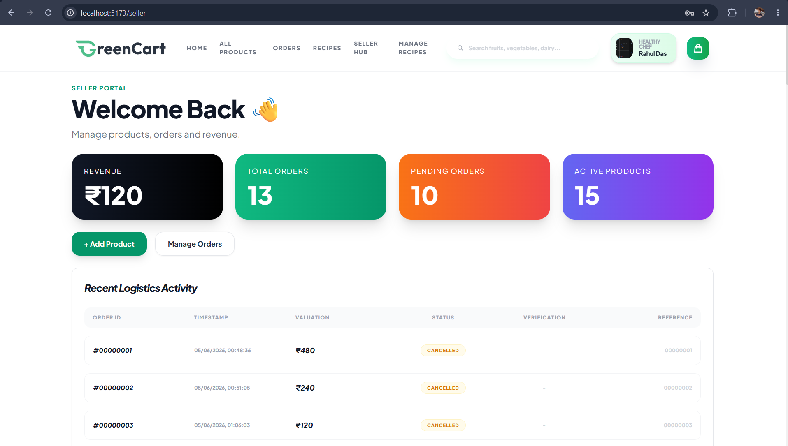
<p align="center"><b>Seller Dashboard</b></p>
</td>
<td width="50%" valign="top">
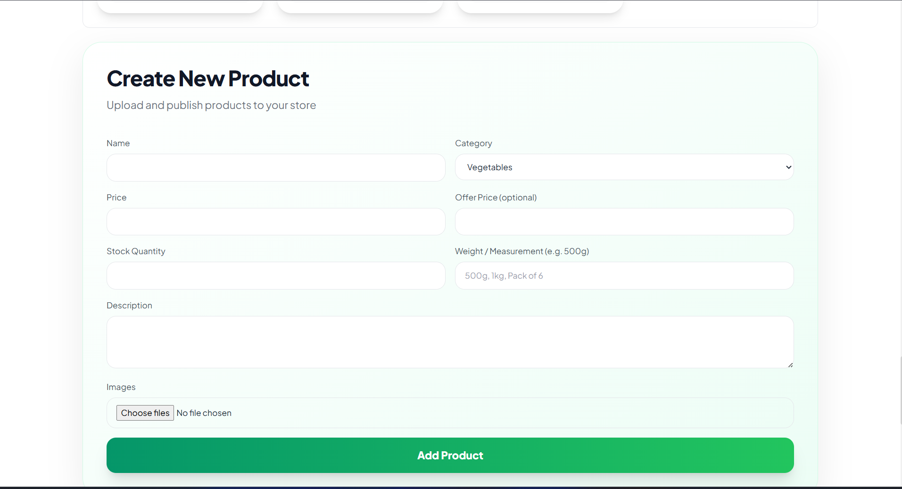
<p align="center"><b>Product Creation</b></p>
</td>
</tr>
<tr>
<td width="50%" valign="top">
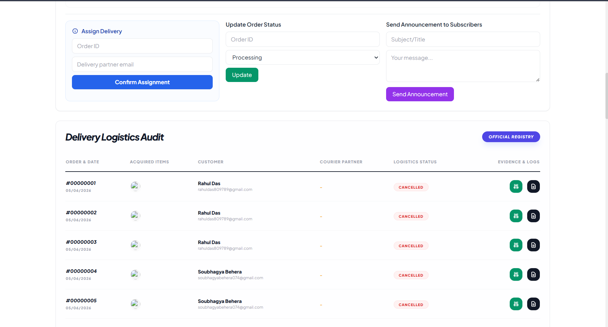
<p align="center"><b>Seller Audit</b></p>
</td>
<td width="50%" valign="top">
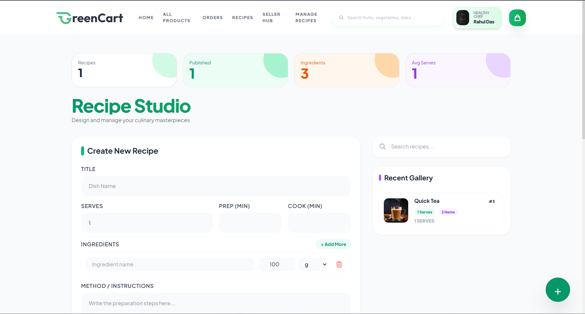
<p align="center"><b>Recipe Studio</b></p>
</td>
</tr>
</table>

### Architecture

<p align="center">
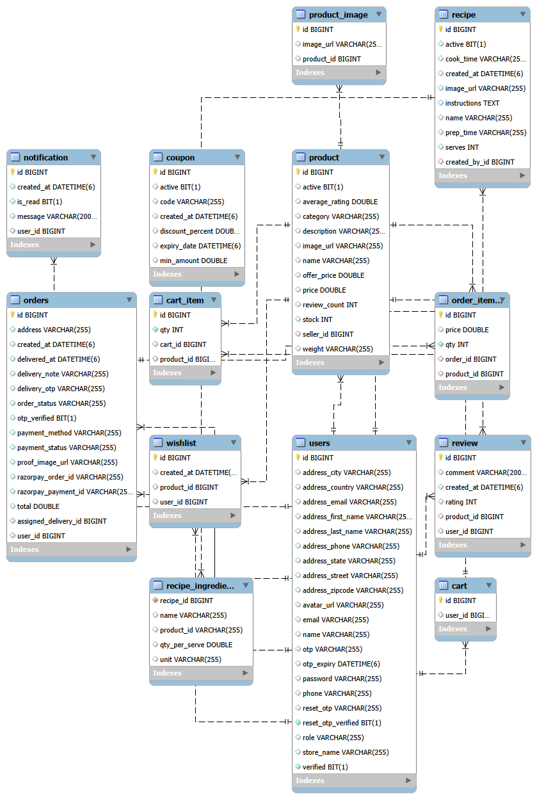
</p>
<p align="center"><b>Database Schema</b></p>

<details>
<summary>🎥 Demo Recording</summary>

> Demo recording placeholder — add a verified GIF/video asset when available.

</details>

---

## 🔌 API Reference

Fourteen endpoint families, verified against the controllers. Most-used endpoints are listed inline; complete lists live in the collapsed sections.

### Authentication — `/auth`

```text
POST /auth/register
POST /auth/login
GET  /auth/me
POST /auth/verify-otp
POST /auth/request-reset-otp
POST /auth/verify-reset-otp
POST /auth/reset-password
PUT  /auth/profile
GET  /auth/address
PUT  /auth/address
POST /auth/avatar
```

### Orders — `/orders`

```text
POST /orders/checkout
GET  /orders/my
PUT  /orders/{id}/cancel
PUT  /orders/{id}/ack/pick
PUT  /orders/{id}/ack/deliver
POST /orders/{id}/proof
POST /orders/{id}/otp/resend
```

### Payments — `/payment`

```text
POST /payment/create-order?orderId=
POST /payment/verify
```

<details>
<summary>📦 Products, cart, reviews, recipes</summary>

```text
GET    /products
GET    /products/categories
POST   /products
POST   /products/upload
GET    /products/{id}
GET    /products/mine
PUT    /products/{id}/stock
DELETE /products/{id}

GET    /cart
POST   /cart/add
PUT    /cart/item/{id}
DELETE /cart/item/{id}

POST /reviews
GET  /reviews/product/{id}
GET  /reviews/check/{productId}

GET    /recipes
GET    /recipes/{id}
POST   /recipes
PUT    /recipes/{id}
DELETE /recipes/{id}
```

</details>

<details>
<summary>🧑‍💼 Seller, admin, delivery</summary>

```text
GET /seller/orders
GET /seller/analytics
PUT /seller/orders/{id}/status
PUT /seller/orders/{id}/assign

GET /admin/users
GET /admin/products
GET /admin/orders
GET /admin/delivery-partners
PUT /admin/users/{id}/role
PUT /admin/orders/{id}/status
GET /admin/analytics

GET /delivery/me
PUT /delivery/availability
GET /delivery/overview
GET /delivery/requests
GET /delivery/orders
PUT /delivery/orders/{id}/accept
PUT /delivery/orders/{id}/reject
PUT /delivery/orders/{id}/delivered
```

</details>

<details>
<summary>🎟️ Coupons, wishlist, notifications, newsletter</summary>

```text
POST   /admin/coupons
GET    /admin/coupons
PUT    /admin/coupons/{id}
DELETE /admin/coupons/{id}
GET    /coupons
POST   /coupons/apply

POST   /wishlist/add/{productId}
GET    /wishlist
DELETE /wishlist/remove/{id}

POST /notifications/send
GET  /notifications/my
PUT  /notifications/read/{id}

POST /newsletter/subscribe
POST /newsletter/announce
```

</details>

### API authorization

| Endpoint | Auth | Role / Ownership |
| --- | --- | --- |
| `GET /products`, `GET /products/{id}`, `GET /recipes` | Public | — |
| `POST /products`, `PUT /products/{id}/stock`, `DELETE /products/{id}` | JWT | Seller (owner) / Admin |
| `GET, POST, PUT, DELETE /cart*` | JWT | Own cart |
| `POST /orders/checkout`, `GET /orders/my` | JWT | Customer (owner) |
| `POST /payment/create-order`, `POST /payment/verify` | JWT | Order owner / Admin |
| `PUT /seller/orders/{id}/status`, `PUT /seller/orders/{id}/assign` | JWT | Seller (owns items) / Admin |
| `PUT /delivery/orders/{id}/accept`, `PUT /delivery/orders/{id}/reject` | JWT | Delivery |
| `PUT /admin/users/{id}/role`, `GET /admin/*` | JWT | Admin |

<details>
<summary>📦 Checkout request / response</summary>

```http
POST /orders/checkout
Authorization: Bearer <jwt>
Content-Type: application/json

{
  "address": "221B Baker Street, Bhubaneswar",
  "paymentMethod": "COD"
}
```

```json
{
  "id": 42,
  "orderStatus": "Processing",
  "paymentStatus": "Pending",
  "total": 549.0
}
```

</details>

<details>
<summary>🔐 Login request / response</summary>

```http
POST /auth/login
Content-Type: application/json

{
  "email": "customer@example.com",
  "password": "********"
}
```

```json
{
  "token": "<jwt>",
  "user": { "id": 7, "email": "customer@example.com", "role": "user" }
}
```

</details>

<details>
<summary>💳 Payment verify request</summary>

```http
POST /payment/verify
Authorization: Bearer <jwt>
Content-Type: application/json

{
  "orderId": 42,
  "razorpayOrderId": "order_Nx...",
  "razorpayPaymentId": "pay_Nx...",
  "razorpaySignature": "<hmac-sha256>"
}
```

</details>

<details>
<summary>🚚 Delivery accept request</summary>

```http
PUT /delivery/orders/42/accept
Authorization: Bearer <jwt>
```

```json
{ "orderId": 42, "orderStatus": "OutForDelivery" }
```

A concurrent loser receives `409 Conflict` instead.

</details>

---

## 🗄️ Domain Model

Core entities (`Backend/src/main/java/com/example/greencart/entity/`): `User`, `Product`, `ProductImage`, `Cart`, `CartItem`, `Order`, `OrderItem`, `Review`, `Recipe` (+ embeddable `RecipeIngredient`), `Coupon`, `Wishlist`, `Notification`, `OrderRejection`.

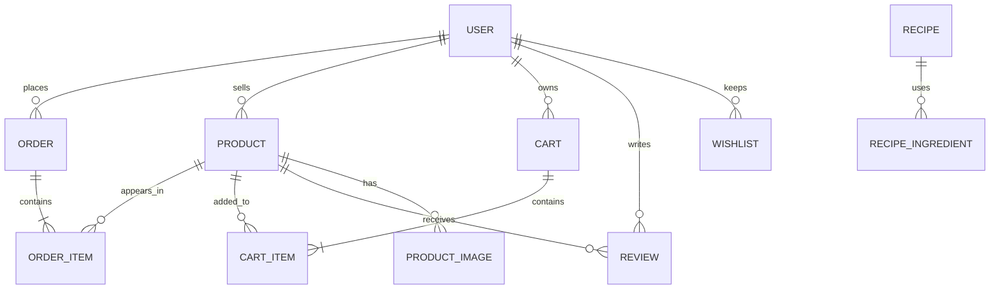
```mermaid
erDiagram
    USER ||--o{ ORDER : places
    USER ||--o{ PRODUCT : sells
    USER ||--o{ CART : owns
    USER ||--o{ REVIEW : writes
    USER ||--o{ WISHLIST : keeps
    ORDER ||--|{ ORDER_ITEM : contains
    PRODUCT ||--o{ ORDER_ITEM : appears_in
    CART ||--|{ CART_ITEM : contains
    PRODUCT ||--o{ CART_ITEM : added_to
    PRODUCT ||--o{ REVIEW : receives
    PRODUCT ||--o{ PRODUCT_IMAGE : has
    RECIPE ||--o{ RECIPE_INGREDIENT : uses
```

---

## 🧰 Tech Stack

| Layer | Technology |
| --- | --- |
| Backend | Java 17, Spring Boot 3.2.5, Spring Web, Spring Data JPA, Spring Security, Spring Validation, Spring Mail, WebSocket/STOMP, Lombok, Maven |
| Database | PostgreSQL (Spring Data JPA, Hibernate, `ddl-auto=update`) |
| Auth | JJWT 0.11.5, BCrypt |
| Payments | Razorpay Java SDK 1.4.3 |
| Frontend | React 19, Vite 7, Tailwind CSS 3, React Router 7 (BrowserRouter shell + custom route guards), React Icons 5, STOMP.js 7 |
| Email | Gmail SMTP (OTP + password reset) |
| Storage | Local filesystem (`uploads/` served at `/uploads/**`) |

> [!NOTE]
> The runtime database is PostgreSQL — `Backend/pom.xml` declares only the PostgreSQL driver. The tracked `application-example.properties` template still shows MySQL values and is stale; follow the PostgreSQL setup below instead.

---

## 🚀 Getting Started

### Prerequisites

- Java 17+
- Maven (wrapper `mvnw` included)
- Node.js + npm
- PostgreSQL 14+
- Razorpay test key + secret
- Gmail address + app password (for OTP emails)

### Clone

```bash
git clone https://github.com/soubhagya-behera/GreenCart.git
cd GreenCart
```

### Database (PostgreSQL)

```bash
createdb greencart
```

```properties
spring.datasource.url=jdbc:postgresql://localhost:5432/greencart
spring.datasource.username=postgres
spring.datasource.password=YOUR_DB_PASSWORD
spring.jpa.database-platform=org.hibernate.dialect.PostgreSQLDialect
spring.jpa.hibernate.ddl-auto=update
server.port=8080
```

> [!WARNING]
> Do not copy the MySQL values from `application-example.properties` — that template predates the MySQL → PostgreSQL migration and will not work with the current PostgreSQL-only driver.

### Backend

```bash
cd Backend
cp src/main/resources/application-example.properties src/main/resources/application.properties
# edit application.properties with the PostgreSQL, SMTP, Razorpay and JWT settings above
./mvnw spring-boot:run
```

Backend URL: `http://localhost:8080`. An admin account can be seeded via the `ADMIN_EMAIL` / `ADMIN_PASSWORD` environment variables (`AdminBootstrap`).

### Frontend

```bash
cd Frontend
npm install
npm run dev
```

Frontend URL: `http://localhost:5173`. Point the frontend at the backend with `VITE_API_URL` (defaults to `http://localhost:8080` locally; the code falls back to the Render backend URL outside localhost).

<details>
<summary>⚙️ Full configuration reference</summary>

```properties
# Database (PostgreSQL — current)
spring.datasource.url=jdbc:postgresql://localhost:5432/greencart
spring.datasource.username=YOUR_DB_USERNAME
spring.datasource.password=YOUR_DB_PASSWORD
spring.jpa.database-platform=org.hibernate.dialect.PostgreSQLDialect
spring.jpa.hibernate.ddl-auto=update

# Server
server.port=8080

# Mail (Gmail SMTP — OTP + password reset)
spring.mail.username=YOUR_GMAIL_ADDRESS
spring.mail.password=YOUR_GMAIL_APP_PASSWORD

# Payments (Razorpay test credentials)
razorpay.key=YOUR_RAZORPAY_KEY
razorpay.secret=YOUR_RAZORPAY_SECRET

# Uploads
spring.servlet.multipart.max-file-size=10MB

# First admin seed (environment variables)
ADMIN_EMAIL=admin@example.com
ADMIN_PASSWORD=choose-a-strong-password
```

```bash
# Frontend (.env.local — VITE_API_URL is the only key the app reads)
VITE_API_URL=http://localhost:8080
```

`Backend/src/main/resources/application.properties` is gitignored and never committed.

</details>

---

## 🌍 Deployment

| Component | Configuration found in repo |
| --- | --- |
| Backend | `Frontend/src/lib/api.js` defaults non-localhost traffic to `https://grocery-delivery-backend-dvr3.onrender.com` (Render); override with `VITE_API_URL` |
| Frontend | `vercel.json` contains an SPA rewrite (`/(.*)` → `/index.html`), suitable for Vercel/static hosting |
| Live frontend URL | No verified live frontend URL is documented in the repo, so none is claimed here |

Docker is not currently included in this repository — no `Dockerfile` or compose files exist.

---

## ⚠️ Current Constraints

- Local filesystem uploads: images live on the server's `uploads/` directory (gitignored), not cloud object storage.
- Single-instance WebSocket behavior: the STOMP broker is the in-memory simple broker, with no external message broker for horizontal scaling.
- `application-example.properties` still shows MySQL values although the app runs on PostgreSQL — use the PostgreSQL setup above.
- Development-oriented configuration: permissive CORS/WS origin patterns, a demo auto-delivery scheduler enabled by default (`greencart.demo-auto-delivery.enabled`), and `ddl-auto=update`.
- No formal CI pipeline in the repository.

---

## 🧪 Testing

The backend ships 15 test files, mostly controller-security, guard/DTO/analytics, publisher, and delivery-service tests (`Backend/src/test/...`):

```bash
cd Backend
./mvnw test
```

```bash
cd Frontend
npm run lint
npm run build
```

No coverage percentage or E2E suite is claimed — the tests above are what the repository contains.

---

## 📁 Project Structure

```text
GreenCart/
├── Backend/
│   ├── src/main/java/com/example/greencart/
│   │   ├── controller/    # 14 REST controllers (auth, product, cart, order, ...)
│   │   ├── service/       # auth, delivery, email, uploads, razorpay, events, demo scheduler
│   │   ├── repository/    # Spring Data JPA repositories
│   │   ├── entity/        # User, Product, Order, Cart, Review, Recipe, Coupon, ...
│   │   ├── dto/           # request/response DTOs
│   │   ├── config/        # security, CORS, WebSocket, bootstrapping
│   │   ├── security/      # JwtFilter
│   │   ├── event/         # delivery + inventory events
│   │   ├── exception/     # global handler, 401/403/409 mapping
│   │   └── util/          # JwtUtil, AccessGuard, RoleChecker, OrderStatuses
│   ├── src/main/resources/
│   │   ├── application.properties            # local only (gitignored)
│   │   └── application-example.properties    # tracked template (MySQL values stale)
│   ├── src/test/          # 15 test files
│   └── pom.xml            # Spring Boot 3.2.5, Java 17, PostgreSQL, JJWT, Razorpay
├── Frontend/
│   ├── src/
│   │   ├── pages/         # customer, seller, admin, delivery portals
│   │   ├── components/    # admin, seller, delivery, common UI
│   │   ├── lib/           # api, sockets, order store, access guards, router
│   │   └── assets/
│   ├── vercel.json        # SPA rewrite
│   └── package.json       # React 19, Vite 7, Tailwind 3, STOMP.js 7
├── screenshots/           # 13 verified screenshots
└── README.md
```

---

## 🗺️ Roadmap

Deliberately excludes already-implemented work (real-time tracking, coupons, wishlist, and delivery lifecycle all exist today).

- Cloud object storage for product/recipe/proof images
- External STOMP broker for multi-instance WebSocket scaling
- Production secrets management (vault/managed secrets instead of properties files)
- Richer analytics and seller reporting
- Push notifications for order and delivery events
- Automated CI/CD pipeline
- Integration and E2E test coverage

---

## 🧠 Engineering Takeaways

GreenCart demonstrates practical work across secure API design (stateless JWT, ownership guards), stateful e-commerce workflows (transactional checkout, status machines), payment integrity (server-side amounts, signature verification), real-time communication (STOMP topics and user queues with auth-checked subscriptions), delivery concurrency (atomic conditional assignment), file handling, and a multi-portal React UI with role-aware routing.

---

## 🤝 Contributing

PRs, bug reports, documentation improvements, and constructive feedback are welcome. Before submitting: keep changes focused, preserve the security boundaries (auth, ownership, payment verification), test affected behavior, and never commit credentials.

<details>
<summary>⭐ Star History</summary>

<p align="center">


</p>

</details>

---

<div align="center">

### 👨‍💻 Built by Soubhagya Kumar Behera

Java Full Stack Developer · Spring Boot · React · Distributed Systems

<p>
<a href="https://github.com/soubhagya-behera"></a>
<a href="https://www.linkedin.com/in/soubhagyakumar-java"></a>
<a href="https://soubhagya-dev.vercel.app"></a>
</p>

⭐ If GreenCart was useful or interesting, consider starring the repository.

</div>
